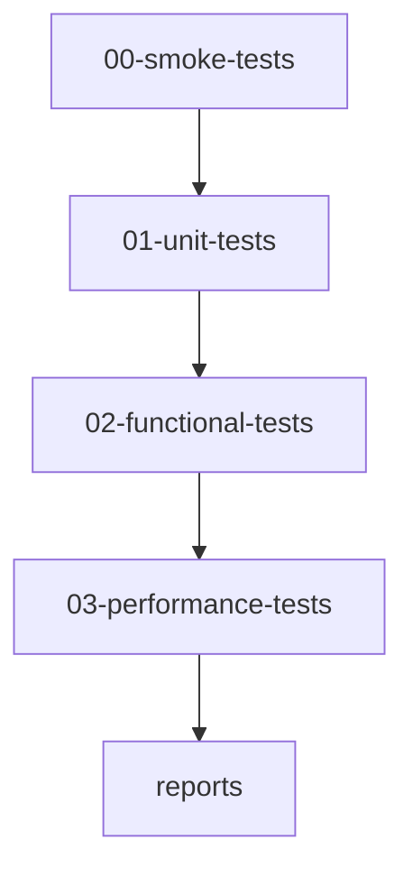

# 🔍 VERIFICACIÓN Y TESTING - Sistema Ticketero

Documentación organizada para verificar el funcionamiento completo del Sistema Ticketero.

## 📋 **GUÍA DE USO RÁPIDO**

### **🚀 Para Desarrolladores Nuevos:**
1. **Smoke Tests** → [`00-smoke-tests/`](./00-smoke-tests/)
2. **Unit Tests** → [`01-unit-tests/`](./01-unit-tests/)
3. **Functional Tests** → [`02-functional-tests/`](./02-functional-tests/)

### **🔧 Para QA/Testing:**
1. **Performance Tests** → [`03-performance-tests/`](./03-performance-tests/)
2. **Reportes** → [`reports/`](./reports/)

---

## 📁 **ESTRUCTURA REAL**

### **00-smoke-tests/** - Pruebas Básicas de Funcionamiento
- `README.md` - Guía de smoke tests
- `quick-start.bat` - Script de validación rápida (Windows)

### **01-unit-tests/** - Pruebas Unitarias
- `README.md` - Guía de unit tests
- `UNIT-TESTS-CRITERIA.md` - Criterios de testing
- `UNIT-TESTS-GUIDE.md` - Guía detallada
- `UNIT-TESTS-REPORT.md` - Reporte de resultados

### **02-functional-tests/** - Pruebas Funcionales
- `README.md` - Guía de functional tests
- `docker-execution-guide.md` - Ejecución con Docker
- `functional-tests-h2.bat` - Tests con H2
- `run-all-tests.bat` - Ejecutar todos los tests
- `test-execution-report.md` - Reporte de ejecución

### **03-performance-tests/** - Pruebas de Rendimiento
- `README.md` - Guía de performance tests
- `performance-test-results.md` - Resultados de pruebas
- `run-all-performance-tests.bat` - Ejecutar todos los tests
- `run-basic-performance-tests.bat` - Tests básicos

### **reports/** - Reportes y Análisis
- `.keep` - Directorio para reportes generados

---

## 🎯 **FLUJO DE VERIFICACIÓN RECOMENDADO**



### **Paso 1: Smoke Tests (5 min)**
```bash
cd docs/verify/00-smoke-tests
./quick-start.bat  # Windows
```

### **Paso 2: Unit Tests (10 min)**
```bash
cd docs/verify/01-unit-tests
# Seguir guía en README.md
```

### **Paso 3: Functional Tests (20 min)**
```bash
cd docs/verify/02-functional-tests
./run-all-tests.bat  # Ejecutar todos los tests
```

### **Paso 4: Performance Tests (30 min)**
```bash
cd docs/verify/03-performance-tests
./run-basic-performance-tests.bat
```

### **Paso 5: Revisar Reportes**
```bash
cd docs/verify/reports
# Revisar reportes generados
```

---

## 📊 **MATRIZ DE VERIFICACIÓN**

| Componente | Smoke Tests | Unit Tests | Functional Tests | Performance Tests | Status |
|------------|-------------|------------|------------------|-------------------|--------|
| **API REST** | ✅ | ✅ | ✅ | ✅ | PASS |
| **Base de Datos** | ✅ | ✅ | ✅ | ✅ | PASS |
| **Schedulers** | ✅ | ✅ | ✅ | ✅ | PASS |
| **Telegram Bot** | ✅ | ✅ | ✅ | ✅ | PASS |
| **Business Rules** | ✅ | ✅ | ✅ | ✅ | PASS |

---

## 🛠️ **HERRAMIENTAS INCLUIDAS**

### **Scripts Automatizados:**
- ✅ Smoke Tests (quick-start.bat)
- ✅ Functional Tests (run-all-tests.bat)
- ✅ Performance Tests (run-basic-performance-tests.bat)
- ✅ H2 Database Tests (functional-tests-h2.bat)

### **Documentación:**
- ✅ Guías paso a paso en cada directorio
- ✅ Criterios de testing (UNIT-TESTS-CRITERIA.md)
- ✅ Reportes de ejecución
- ✅ Resultados de performance

---

## 📞 **SOPORTE**

### **Para Problemas:**
1. Revisar [`03-performance-tests/performance-test-results.md`](./03-performance-tests/performance-test-results.md)
2. Ejecutar [`00-smoke-tests/quick-start.bat`](./00-smoke-tests/quick-start.bat)
3. Consultar [`02-functional-tests/test-execution-report.md`](./02-functional-tests/test-execution-report.md)

### **Para Nuevas Funcionalidades:**
1. Actualizar tests en [`02-functional-tests/`](./02-functional-tests/)
2. Agregar unit tests en [`01-unit-tests/`](./01-unit-tests/)
3. Documentar en [`reports/`](./reports/)

---

**Última actualización:** 2025-12-24  
**Versión del sistema:** 1.0.0  
**Estado:** TESTING FRAMEWORK READY ✅