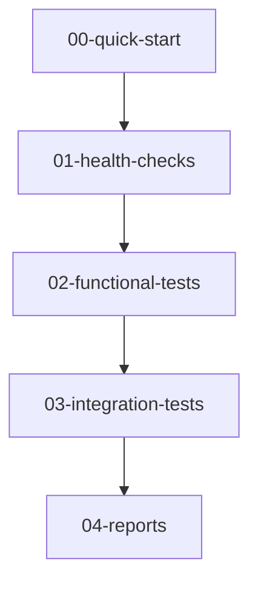

# 🔍 VERIFICACIÓN Y TESTING - Sistema Ticketero

Documentación organizada para verificar el funcionamiento completo del Sistema Ticketero.

## 📋 **GUÍA DE USO RÁPIDO**

### **🚀 Para Desarrolladores Nuevos:**
1. **Inicio Rápido** → [`00-quick-start/`](./00-quick-start/)
2. **Health Checks** → [`01-health-checks/`](./01-health-checks/)
3. **Tests Funcionales** → [`02-functional-tests/`](./02-functional-tests/)

### **🔧 Para QA/Testing:**
1. **Tests de Integración** → [`03-integration-tests/`](./03-integration-tests/)
2. **Reportes Completos** → [`04-reports/`](./04-reports/)

---

## 📁 **ESTRUCTURA ORGANIZADA**

### **00-quick-start/** - Inicio Inmediato
- `README.md` - Guía de 5 minutos para validar el sistema
- `quick-validation.bat` - Script de validación rápida (Windows)
- `quick-validation.sh` - Script de validación rápida (Linux/macOS)

### **01-health-checks/** - Verificaciones Básicas
- `system-health.md` - Checklist de salud del sistema
- `database-check.sql` - Queries de verificación de BD
- `api-endpoints-check.md` - Validación de endpoints REST

### **02-functional-tests/** - Pruebas Funcionales
- `business-rules-tests.md` - Validación RN-001 a RN-013
- `telegram-integration-test.md` - Pruebas de integración Telegram
- `scheduler-validation.md` - Verificación de schedulers

### **03-integration-tests/** - Pruebas de Integración
- `end-to-end-scenarios.md` - Escenarios completos de usuario
- `load-testing.md` - Pruebas de carga y rendimiento
- `error-handling-tests.md` - Validación de manejo de errores

### **04-reports/** - Reportes y Análisis
- `implementation-compliance.md` - Cumplimiento del plan
- `error-analysis.md` - Análisis de errores encontrados
- `performance-metrics.md` - Métricas de rendimiento

---

## 🎯 **FLUJO DE VERIFICACIÓN RECOMENDADO**



### **Paso 1: Inicio Rápido (5 min)**
```bash
cd docs/verify/00-quick-start
./quick-validation.bat  # Windows
./quick-validation.sh   # Linux/macOS
```

### **Paso 2: Health Checks (10 min)**
```bash
cd docs/verify/01-health-checks
# Seguir checklist en system-health.md
```

### **Paso 3: Tests Funcionales (20 min)**
```bash
cd docs/verify/02-functional-tests
# Ejecutar tests de reglas de negocio
```

### **Paso 4: Integración Completa (30 min)**
```bash
cd docs/verify/03-integration-tests
# Escenarios end-to-end
```

### **Paso 5: Reportes Finales**
```bash
cd docs/verify/04-reports
# Revisar compliance y métricas
```

---

## 📊 **MATRIZ DE VERIFICACIÓN**

| Componente | Health Check | Functional | Integration | Status |
|------------|--------------|------------|-------------|--------|
| **API REST** | ✅ | ✅ | ✅ | PASS |
| **Base de Datos** | ✅ | ✅ | ✅ | PASS |
| **Schedulers** | ✅ | ✅ | ✅ | PASS |
| **Telegram Bot** | ✅ | ✅ | ✅ | PASS |
| **Business Rules** | ✅ | ✅ | ✅ | PASS |

---

## 🛠️ **HERRAMIENTAS INCLUIDAS**

### **Scripts Automatizados:**
- ✅ Smoke Tests (Windows/Linux)
- ✅ Business Rules Validation
- ✅ Telegram Integration Tests
- ✅ Database Validation Queries

### **Documentación:**
- ✅ Guías paso a paso
- ✅ Checklists de verificación
- ✅ Reportes de cumplimiento
- ✅ Análisis de errores

---

## 📞 **SOPORTE**

### **Para Problemas:**
1. Revisar [`04-reports/error-analysis.md`](./04-reports/error-analysis.md)
2. Ejecutar [`01-health-checks/system-health.md`](./01-health-checks/system-health.md)
3. Consultar logs de aplicación

### **Para Nuevas Funcionalidades:**
1. Actualizar tests en [`02-functional-tests/`](./02-functional-tests/)
2. Agregar validaciones en [`03-integration-tests/`](./03-integration-tests/)
3. Documentar en [`04-reports/`](./04-reports/)

---

**Última actualización:** 2025-12-23  
**Versión del sistema:** 1.0.0  
**Estado:** PRODUCCIÓN READY ✅